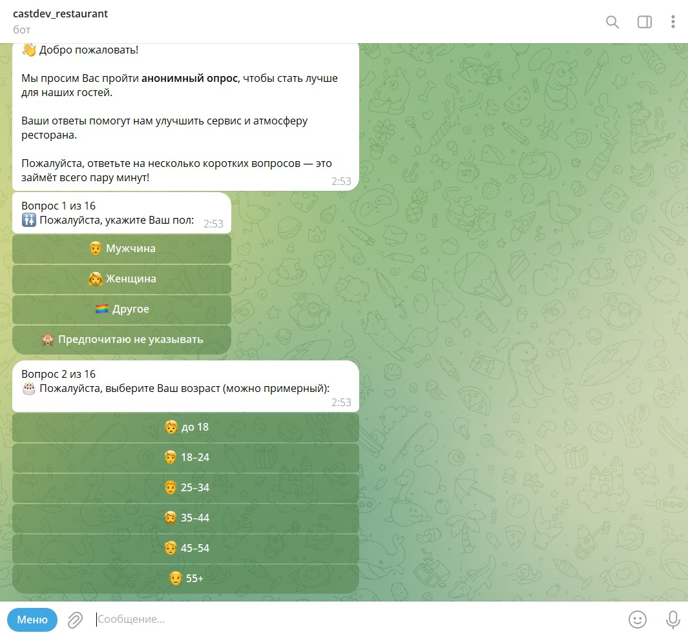
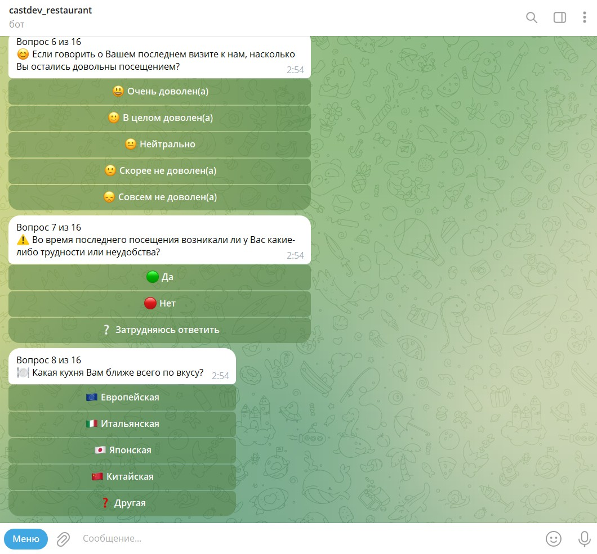
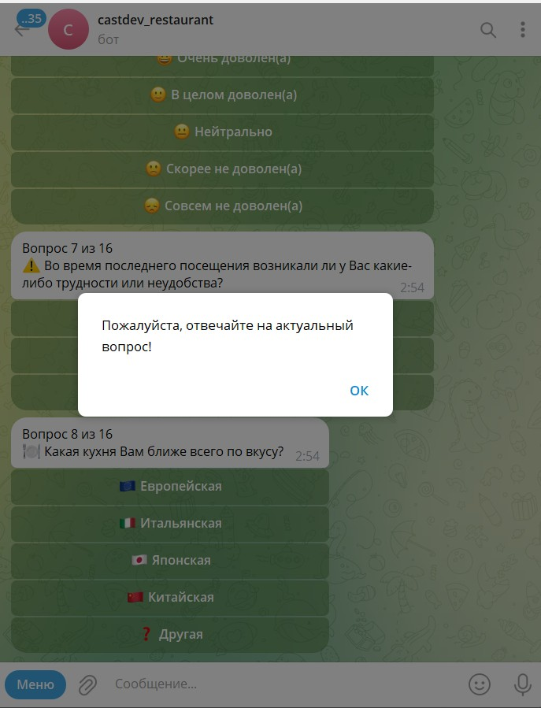
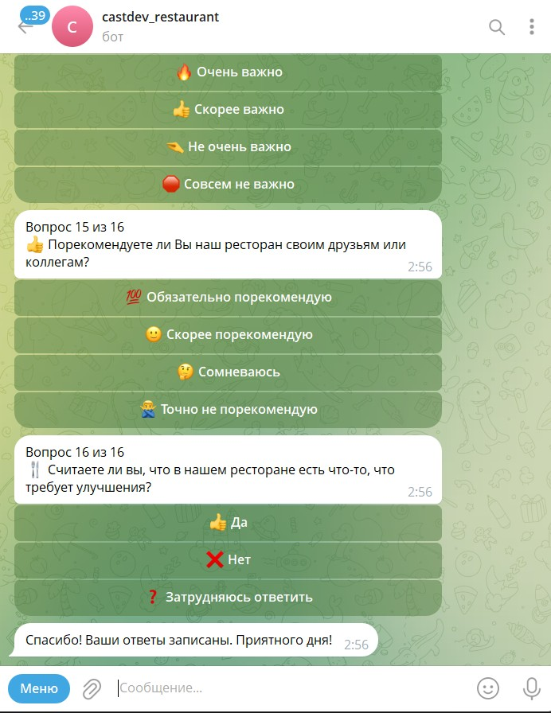

# 🎉 Система кастдев-опроса клиентов ресторана (Telegram-бот + Google Sheets)

Этот проект — современный Telegram-бот для анонимного кастдев-опроса гостей ресторана. Все ответы автоматически сохраняются в Google Таблицу для последующего анализа и принятия управленческих решений.

Вопросы и варианты ответов оформлены с помощью эмодзи, чтобы сделать опрос стильным, дружелюбным и удобным для пользователя!

**Все ответы анонимны и используются только для улучшения сервиса.**

---

## 🖼️ Примеры работы (скриншоты)

Вот как выглядит работа Telegram-бота для опроса клиентов:






---

## 📦 Структура проекта
```
castdev_restaurant_clients/
│
├── bot/
│   ├── __init__.py
│   ├── column_mapping.py   # Маппинг ключей вопросов на названия колонок Google Sheets
│   ├── config.py           # Хранение токенов и параметров из .env
│   ├── google_sheets.py    # Работа с Google Sheets API
│   ├── main.py             # Основная логика Telegram-бота (aiogram FSM)
│   ├── questions.py        # Список вопросов для опроса с эмодзи
│
├── venv/                  # Виртуальное окружение Python
├── .env                   # Переменные окружения (скрытый токен и ключи)
├── .env.example           # Пример файла переменных окружения
├── .gitignore             # Исключение секретов и venv из git
├── creds.json             # Ключи сервисного аккаунта Google (не коммитить!)
├── README.md              # Описание проекта
├── requirements.txt       # Список зависимостей Python
├── run.py                 # Альтернативная точка входа (опционально)
├── start_bot.bat          # Быстрый запуск бота на Windows
```

---

## 🚀 Быстрый старт

1. **Установите Python 3.10+ и зависимости:**
   ```sh
   pip install -r requirements.txt
   ```
2. Получите токен Telegram-бота через @BotFather и JSON-файл сервисного аккаунта Google (Google Cloud Console). Поместите файл `creds.json` в корень проекта.
3. Создайте Google Таблицу с колонками (см. ниже) и дайте сервисному аккаунту права "Редактор".
4. Создайте и заполните файл `.env` по образцу из `.env.example`:
   ```env
   BOT_TOKEN=...
   GOOGLE_SHEETS_CREDS=creds.json
   GOOGLE_SHEET_ID=...
   ```
5. Запустите бота:
   ```sh
   python -m bot.main
   ```
   или (Windows)
   ```sh
   start_bot.bat
   ```
6. Ответы пользователей будут автоматически сохраняться в Google Таблицу.

---

## 🤖 Логика опроса
- Опрос начинается с приветствия 👋, затем вопросы о поле 🚻 и возрасте 🎂 (анонимно).
- Все вопросы проходят последовательно, поддерживается логика пропуска (например, вопрос о проблемах 📝 появляется только если пользователь сообщил о трудностях ⚠️).
- Для большинства вопросов используются стильные инлайн-кнопки с эмодзи.
- Для текстовых вопросов ожидается свободный ввод (бот пишет: "Введите, пожалуйста, Ваш ответ:").
- Контактные данные не собираются.
- После завершения опроса все ответы сохраняются в Google Sheets.

**Внимание:**
Нумерация "Вопрос N из M" отображается только для основных вопросов. Все уточняющие вопросы (например, пояснения по трудностям, блюдам, предложениям по улучшению) выводятся без номера и не увеличивают прогресс.

**Особенности логики:**
- Если выбран вариант "🍲 Не хватает определённых блюд" — бот сразу уточнит, каких именно блюд не хватает (отдельный вопрос).
- Если выбран вариант "❓ Другая" (например, для кухни или важных факторов) — бот может предложить ввести свой вариант (по желанию).
- Вопрос об улучшениях задаётся с кнопками "Да/Нет"; если "Да" — появляется строка для ввода предложения.

---

## 📊 Примеры вариантов для кнопочных вопросов

**Любимая кухня:**
- 🇪🇺 Европейская
- 🇮🇹 Итальянская
- 🇯🇵 Японская
- 🇨🇳 Китайская
- ❓ Другая

**Важные факторы при выборе ресторана:**
- 🍽️ Кухня
- 🎶 Атмосфера
- 💰 Цена
- 📍 Расположение
- 🅿️ Парковка
- ❓ Другое

---

## 📊 Перечень вопросов и маппинг для Google Таблицы
| Ключ                      | Колонка в Google Sheets                |
|---------------------------|----------------------------------------|
| timestamp                 | Дата и время ответа                    |
| username                  | Имя пользователя (Telegram)            |
| user_id                   | Telegram ID                            |
| gender                    | Пол                                    |
| age                       | Возраст                                |
| first_time                | Ранее бывал в ресторане                |
| visit_source              | Как узнал о ресторане                  |
| visit_frequency           | Частота посещения ресторанов           |
| last_visit_satisfaction   | Удовлетворён последним визитом         |
| last_visit_issues         | Были ли трудности при визите           |
| issues_description        | Описание трудностей                    |
| cuisine_preference        | Любимая кухня                          |
| menu_satisfaction         | Устраивает меню                        |
| menu_missing_dishes       | Недостающие блюда                      |
| avg_bill                  | Комфортный средний чек                 |
| reservation_preference    | Способ бронирования                    |
| important_factors         | Важные факторы при выборе ресторана    |
| delivery_interest         | Пользуется доставкой                   |
| improvement_suggestions   | Что хотел бы улучшить                  |
| loyalty_program           | Важность программы лояльности          |
| recommendation_willingness| Готов рекомендовать ресторан           |

---

## 📝 Вопросы с развёрнутым (текстовым) ответом

В этих случаях бот ожидает, что пользователь введёт свой ответ вручную:

1. **Описание трудностей**  
   📝 Будем признательны, если расскажете подробнее, с чем именно столкнулись:  
   (ключ: `issues_description`)  
   _Появляется только если на вопрос о трудностях выбран ответ «Да»._

2. **Недостающие блюда**  
   Пожалуйста, напишите, каких блюд не хватает:  
   (ключ: `menu_missing_dishes`)  
   _Появляется только если выбран вариант «🍲 Не хватает определённых блюд»._

3. **Улучшения**  
   Пожалуйста, напишите, что бы Вы хотели улучшить:  
   (ключ: `improvement_suggestions_extra`)  
   _Появляется только если пользователь выбрал «Да» на вопросе «Хотели бы Вы предложить что-то улучшить в нашем ресторане?»._

4. **(Опционально)** — если реализовано:  
   При выборе варианта «❓ Другая» (например, для кухни или важных факторов) бот может предложить ввести свой вариант.

---

## 🛠️ Ключевые файлы и модули
- `questions.py` — список вопросов (формулировки, типы, варианты с эмодзи)
- `column_mapping.py` — маппинг ключей вопросов на “человеческие” названия колонок
- `google_sheets.py` — функции для авторизации и записи данных в Google Sheets
- `main.py` — реализация FSM (aiogram) и логики опроса
- `config.py` — переменные окружения и токены
- `run.py` / `start_bot.bat` — быстрая команда для запуска бота

---

## ⚡️ Советы и доработки
- Храните `creds.json` и `.env` только локально (не отправляйте в репозиторий)
- Для анализа данных используйте встроенные инструменты Google Sheets или экспорт в Excel
- При необходимости дорабатывайте опросник под новые задачи (добавляйте вопросы/колонки)

---

**Проект оформлен с заботой о пользователе и стиле!**
